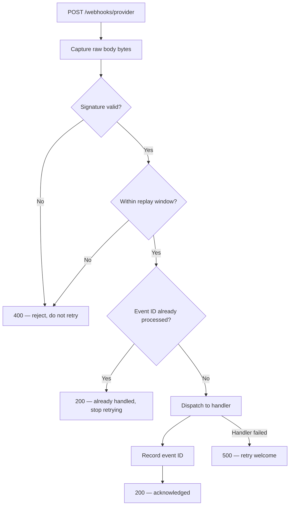

# webhook-guard-py

A signature-verified webhook receiver in Python: HMAC verification with
constant-time comparison, replay-window enforcement, and idempotent
delivery handling.

Python port of [webhook-guard](https://github.com/raishagzz/webhook-guard)
(TypeScript). Both implement the same contract and the same test scenarios.


## Why

Webhook endpoints are public URLs. Anything that reaches one is untrusted
until proven otherwise. This service answers four questions before a payload
is allowed to do anything:

1. Is the signature authentic?
2. Is the delivery recent?
3. Has this event already been processed?
4. Are we verifying the original bytes, or a re-serialized copy?

## Request flow



## Status

- [x] Project scaffold and CI
- [ ] Signature verification
- [ ] Replay-window enforcement
- [ ] Idempotency store
- [ ] FastAPI receiver
- [ ] Threat model and OpenAPI spec

## Development

```bash
python3 -m venv .venv && source .venv/bin/activate
pip install -e ".[dev]"
pytest
ruff check .
```

## License

MIT
