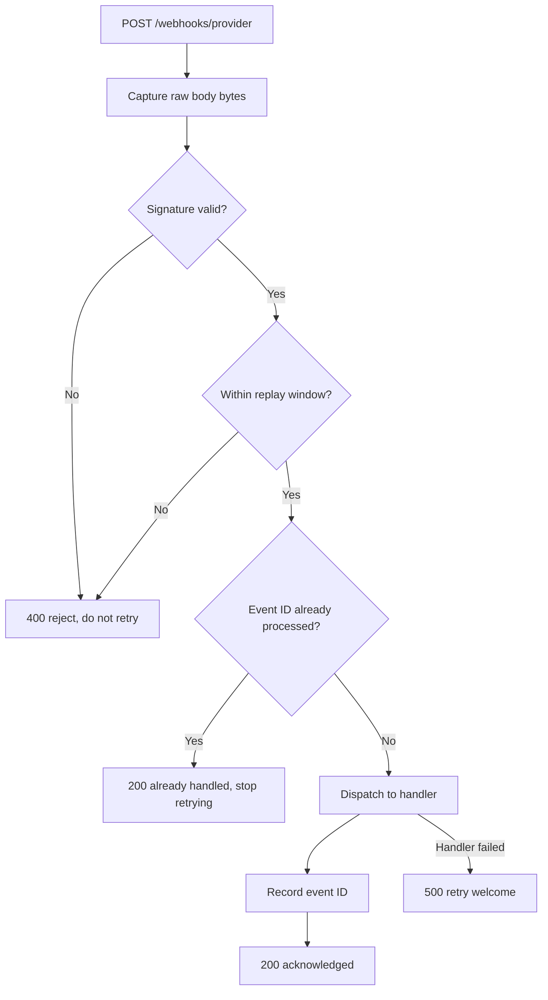

# webhook-guard-py

Signature-verified webhook receiver in Python. HMAC verification with
constant-time comparison, replay-window enforcement, idempotent delivery
handling.

Python port of [webhook-guard](https://github.com/raishagzz/webhook-guard)
(TypeScript). Same contract, same status-code semantics, same test scenarios,
implemented independently.


## Why

Webhook endpoints are public URLs. Anything that arrives at one is untrusted
until proven otherwise.

I built the TypeScript version first, working from payment webhook handling
I've shipped on a production FastAPI service. Both repos are clean-room
implementations of that design; no code from that system is reproduced here.
This one exists because the original problem was a Python problem, and porting
it back made the design easier to talk about.

Four questions get answered before a payload does anything:

1. Is the signature authentic?
2. Is the delivery recent?
3. Has this event already been processed?
4. Are we checking the original bytes, or a copy of them?

## Request flow



## Threat model

| Threat | Defense | What happens without it |
|---|---|---|
| Forged delivery from an unauthenticated sender | HMAC-SHA256 over `{timestamp}.{raw_body}` with a shared secret | Anyone who finds the URL can trigger business logic |
| Signature recovered through response timing | `hmac.compare_digest`, which reads the whole digest regardless of where the first mismatch falls | `==` short-circuits, leaking the mismatch position. An attacker walks the signature out one byte at a time |
| Captured delivery replayed later | Two-sided timestamp window, 300s by default | A valid signature stays valid forever, so a leaked request is reusable indefinitely |
| Timestamp rewritten to defeat the window | The timestamp is inside the signed content, not a separate header | An attacker pastes a fresh timestamp onto an old payload and it verifies |
| Duplicate delivery after a lost acknowledgment | Atomic claim on the event ID before the handler runs | The customer gets billed twice |
| Concurrent duplicates racing each other | `claim()` is one operation, not check-then-write | Both copies find the store empty and both proceed |
| Signature checked against re-serialized JSON | Raw body read before anything parses it | Key order or spacing differs by a byte and every signature fails |
| Malformed payload from an unauthenticated sender | Signature verified before `json.loads` | The parser is exposed to unauthenticated input |

## Status codes

The response is an instruction to the provider's retry machinery, not
decoration:

| Code | Meaning | Provider should |
|---|---|---|
| 200 accepted | Processed | Stop retrying |
| 200 duplicate | Already processed | Stop retrying |
| 400 | Signature, timestamp, or payload invalid | Never retry. It can't become valid |
| 500 | Handler failed | Retry |

Return 500 on a bad signature and you've invited a retry storm of requests that
can never succeed. Return 200 on a handler failure and the work is silently
dropped.

## Delivery guarantees

An event ID is recorded only after its handler succeeds. If the process dies
between those two steps, the retry runs the handler again. That's at-least-once,
and it's deliberate: recording first would give at-most-once, where a crash
mid-processing marks an event done whose work never happened and nothing ever
comes back for it.

**Handlers have to tolerate running twice.** This reduces duplicates. It can't
eliminate them.

## What this doesn't do

The in-memory store is process-local. It doesn't survive a restart, and two
workers won't see each other's claims. Anything real needs Redis or a unique
constraint on the event ID. `IdempotencyStore` is a Protocol so that swap
touches nothing else.

`handle_event` is a stub. Wire your own work into it.

The signing scheme is one common format. Providers differ, mostly in header
names and how the signed payload is assembled.

## Running it

```bash
cp .env.example .env        # set WEBHOOK_GUARD_SIGNING_SECRET
pip install -e ".[dev]"
uvicorn webhook_guard.receiver:app --reload
```

Docs at `http://localhost:8000/docs`, OpenAPI schema at `/openapi.json`.

With Docker:

```bash
docker build -t webhook-guard .
docker run --rm -p 8000:8000 --env-file .env webhook-guard
```

## Testing

```bash
pytest
ruff check .
ruff format --check .
```

`filterwarnings = ["error"]` means a new warning fails the build. ruff runs
with the security ruleset (`S`) on. `S105` and `S106` are scoped off in
`tests/` only, where the fixtures use deliberately fake secrets.

## License

MIT
